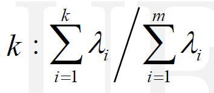

## 1. PCA
### 1.1 对数据进行降维
#### 数据集处理
1. 读取数据集（略）
2. 数据集标准化
对训练集以及两个测试集进行标准化。
    
```python
mean = np.mean(train_data, axis=0)
std = np.std(train_data, axis=0, ddof=1)
normalized_data = (data - mean) / std
```
#### 降维矩阵
3. 协方差矩阵及其特征分解
    1. 计算协方差矩阵
        
    2. 计算协方差矩阵的特征值和特征向量
        
    3. 降序排列特征值，计算累计方差贡献率确定k值
        
    4. 取前k个特征向量得到降维矩阵
```python
# 计算协方差矩阵
standardized_covariance_matrix = np.dot(normalized_data_train.T, normalized_data_train/(4000-1))

# 计算协方差矩阵的特征值和特征向量
eigenvalues, eigenvectors = np.linalg.eig(standardized_covariance_matrix)

# 根据累计方差贡献率确定k值
sorted_eigenvalues = eigenvalues[sorted_indices]
k = 1
while np.sum(sorted_eigenvalues[:k]) / np.sum(eigenvalues) < 0.8:
    k += 1
# 选择前k个特征向量，得到降维矩阵
selected_eigenvectors = sorted_eigenvectors[:, :k]

# 按照特征值降序，对特征向量进行排序
sorted_indices = np.argsort(eigenvalues)[::-1]
sorted_eigenvectors = eigenvectors[:, sorted_indices]
```
### 1.2 对降维结果进行分类
使用平方预测误差(Squared prediction error，SPE)和霍特林统计量（Hotelling’s T2）进行故障检测。
参考：[平方预测误差(Squared prediction error，SPE)和霍特林统计量（Hotelling’s T2）原理](https://blog.csdn.net/weixin_44333889/article/details/119449882)
#### 数据分解
将单个样本分解为主元子空间和残差子空间，分别用于计算T^2统计量(霍特林, T2)和Q统计量(平方预测误差, SPE)。

```python
sp = np.dot(np.dot(P, P.T), x.T)
sr = np.dot(np.eye(31) - np.dot(P, P.T), x.T)
```
#### T^2
计算T^2统计量和监测阈值。

```python
T_2 = np.linalg.norm(sp, axis=0)
Ta = k * (4000 - 1) * (4000 + 1) * f.ppf(0.99, k, 4000-k) / (4000 * (4000 - k))
```
#### Q(SPE)
计算Q统计量和监测阈值。其中Ca取1.6449。


```python
Q = np.linalg.norm(sr, axis=0)
theta1 = np.sum(lambdas[k+1:])
theta2 = np.sum(np.square(lambdas[k+1:]))
theta3 = np.sum(np.power(lambdas[k+1:], 3))
h0 = 1 - 2 * theta1 * theta3 / (3 * theta2 * theta2)
ca = 1.6449
Qa = theta1 * np.power(ca * h0 * np.sqrt(2 * theta2) / theta1 + 1 + theta2 * h0 * (h0 - 1)/ np.power(theta1, 2), 1 / h0)
```
#### 处理结果
将得到的T^2和Q统计量分别与阈值Ta^2和Qa进行比对。小于阈值为正常数据，大于则为异常。

使用了准确率,精确率,召回率作为指标。
* 准确率：正确分类的样本/总样本。
* 精确率：确认为正常的样本中实际为正常的概率。
* 召回率：在实际为正常的样本中你预测为正常的概率。

参考：[全面梳理：准确率,精确率,召回率,查准率,查全率,假阳性,真阳性,PRC,ROC,AUC,F1](https://zhuanlan.zhihu.com/p/34079183)

```python
## 以T_2为例
# TP：真阳率
# FP：假阳率
# TN：真阴率
# FN：假阴率
TP = FP = TN = FN = 0
for i in range(4000):
    if i < 2000:    # 前两千个正常数据
        if T_2[i] < Ta2:    # 判断为正常真阳+1
            TP += 1 
        else:               # 判断为异常假阴+1
            FN += 1
    else:           # 后两千个异常数据
        if T_2[i] > Ta2:
            T_TN += 1       # 判断为异常真阴+1
        else:
            T_FP += 1       # 判断为正常假阳+1
# 计算准确率,精确率,召回率
accuracy = (T_TP + T_TN) / 4000
precision = T_TP / (T_TP + T_FP)
recall = T_TP / (T_TP + T_FN)
# 打印结果
print(f"accuracy:{accuracy}, precision:{precision}, recall:{recall}")
```
### 1.3 分类结果
可以看到，在PCA降维以及SPE和T^2分类处理后，对于测试集1都有较为理想的预测结果。准确率,精确率,召回率都高于99%。
在累计方差贡献率大于80%的情况下，可以确定k值为16.
该方案对于测试集2无法处理。
具体结果图和数据如下：

```
# k = 16
# Test Data 1:
# T: accuracy:0.99675, precision:0.9935419771485345, recall:1.0
# Q: accuracy:0.999, precision:0.998003992015968, recall:1.0
# Test Data 2:
# T: accuracy:0.5, precision:0.5, recall:1.0
# Q: accuracy:0.5, precision:0.5, recall:1.0
```

## 2. DPCA
DPCA的核心思想主要是将原来的数据集进行矩阵增广，获得新的数据集，然后在对新的数据集进行PCA的降维处理。

DPCA仅在数据处理阶段与PCA不同，其余步骤同PCA。

参考：[基于DPCA的线性监督分类的故障诊断方法-T2和SPE统计量的计算](https://blog.csdn.net/And_ZJ/article/details/90576536)
### 矩阵增广

```python
# 矩阵增广
# lag 为滞后矩阵的滞后阶数，即上文中的时延l
def getAugmentedData(data, lag):
    augmented_data = np.zeros((data.shape[0]-lag, data.shape[1]*(lag+1)))
    for i in range(lag+1):
        augmented_data[:, i*data.shape[1]:(i+1)*data.shape[1]] = data[lag-i:-i or None]
    return augmented_data
```

对于矩阵增广和归一化的顺序问题，代码采取的是先增广后归一化。
### 结果
DPCA同样对测试集二无效。
测试集1的结果可以看到T^2统计量的预测结果随着lag增加有微小提升，Q统计量相反。当lag增加到7时，Q统计量的预测已经完全出错。 T^2统计量结果一直几乎保持不变。
从图像可以看出，在lag为7时Q统计量失效的原因是，控制线偏离正常范围。
以下为测试图：


以下为测试数据结果：
```
# Lag: 1
# k = 27
# Test Data 1:
# T: accuracy:0.99675, precision:0.9940357852882704, recall:1.0
# Q: accuracy:0.998, precision:0.9965122072745392, recall:1.0
# Test Data 2:
# T: accuracy:0.5, precision:0.5001250312578145, recall:1.0
# Q: accuracy:0.5, precision:0.5001250312578145, recall:1.0

# Lag: 2
# k = 38
# Test Data 1:
# T: accuracy:0.9965, precision:0.9940357852882704, recall:1.0
# Q: accuracy:0.99475, precision:0.9905894006934126, recall:1.0
# Test Data 2:
# T: accuracy:0.5, precision:0.5002501250625313, recall:1.0
# Q: accuracy:0.5, precision:0.5002501250625313, recall:1.0

# Lag: 3
# k = 49
# Test Data 1:
# T: accuracy:0.99625, precision:0.9940357852882704, recall:1.0
# Q: accuracy:0.98925, precision:0.9803921568627451, recall:1.0
# Test Data 2:
# T: accuracy:0.5, precision:0.5003752814610958, recall:1.0
# Q: accuracy:0.5, precision:0.5003752814610958, recall:1.0

# Lag: 5
# k = 70
# Test Data 1:
# T: accuracy:0.99575, precision:0.9940357852882704, recall:1.0
# Q: accuracy:0.95975, precision:0.9276437847866419, recall:1.0
# Test Data 2:
# T: accuracy:0.5, precision:0.5006257822277848, recall:1.0
# Q: accuracy:0.5, precision:0.5006257822277848, recall:1.0

# Lag: 7
# k = 91
# Test Data 1:
# T: accuracy:0.99525, precision:0.9940357852882704, recall:1.0
# Q: accuracy:0.5415, precision:0.5226025607525477, recall:1.0
# Test Data 2:
# T: accuracy:0.5, precision:0.5008765339343851, recall:1.0
# Q: accuracy:0.5, precision:0.5008765339343851, recall:1.0

# Lag: 10
# k = 121
# Test Data 1:
# T: accuracy:0.99475, precision:0.9945300845350572, recall:1.0
# Q: accuracy:0.51775, precision:0.5103342689461597, recall:1.0
# Test Data 2:
# T: accuracy:0.5, precision:0.5012531328320802, recall:1.0
# Q: accuracy:0.5, precision:0.5012531328320802, recall:1.0

# Lag: 15
# k = 169
# Test Data 1:
# T: accuracy:0.99375, precision:0.9950248756218906, recall:1.0
# Q: accuracy:0.50925, precision:0.5065856129685917, recall:1.0
# Test Data 2:
# T: accuracy:0.5, precision:0.5018820577164367, recall:1.0
# Q: accuracy:0.5, precision:0.5018820577164367, recall:1.0

# Lag: 20
# k = 215
# Test Data 1:
# T: accuracy:0.99275, precision:0.9955201592832255, recall:1.0
# Q: accuracy:0.50925, precision:0.507227998985544, recall:1.0
# Test Data 2:
# T: accuracy:0.5, precision:0.5025125628140703, recall:1.0
# Q: accuracy:0.5, precision:0.5025125628140703, recall:1.0

# Lag: 30
# k = 300
# Test Data 1:
# T: accuracy:0.99075, precision:0.9965122072745392, recall:1.0
# Q: accuracy:0.51, precision:0.5089058524173028, recall:1.0
# Test Data 2:
# T: accuracy:0.5, precision:0.5037783375314862, recall:1.0
# Q: accuracy:0.5, precision:0.5037783375314862, recall:1.0

# Lag: 50
# k = 449
# Test Data 1:
# T: accuracy:0.987, precision:0.999000999000999, recall:1.0
# Q: accuracy:0.5115, precision:0.5122950819672131, recall:1.0
# Test Data 2:
# T: accuracy:0.5, precision:0.5063291139240507, recall:1.0
# Q: accuracy:0.5, precision:0.5063291139240507, recall:1.0
```
